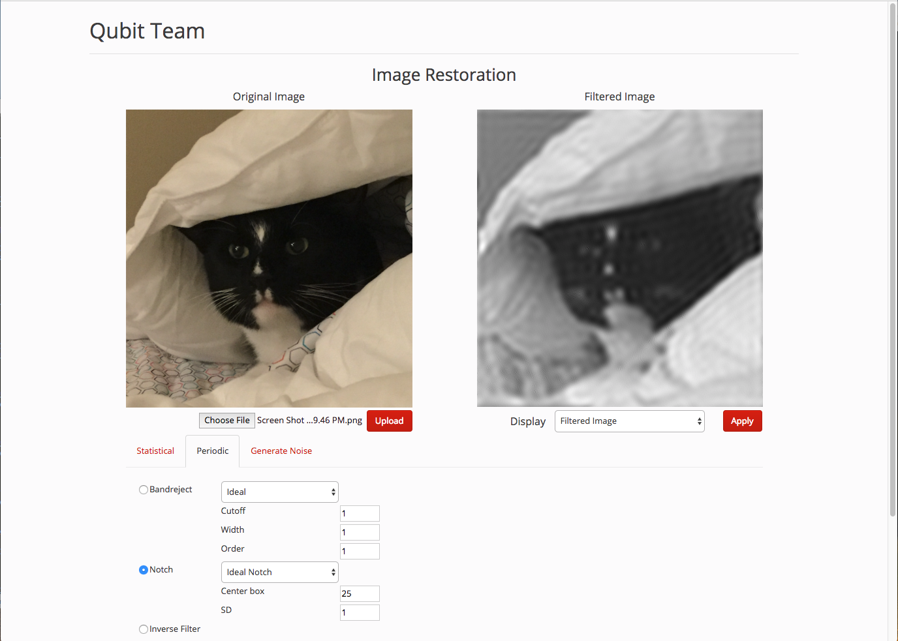

# image-restoration

This repository contains the web application that we 
built for the Digital Image Processing project.

Our report can be found here: [Report](final_report.pdf)


## Requirements

* Python 3.5
* Flask 0.12.2
* OpenCV 3.3.0
* NumPy 1.13.1


## How to run it

Within the project directory, you will see the python 
file `source/app.py`. You need to run that file so that
the web server starts.  

```
$ cd source
$ python app.py
```

That will starts the server with the following URL:

```
http://127.0.0.1:4012/
``` 

You can change the port in the `app.py`, if needed (look 
at the main function at the bottom).


## Interface

Here is an image of the GUI:
 


The left image is the source image (the image input given by 
the user). The user can upload an image choosing it from the 
local directory and then clicking the Upload button. 

After clicking the image, the user is supposed to choose the 
parameters from the tab content being displayed. Once the values 
are chosen, the user should press the Apply button on the right. 
That will send a request to the server, which will reply with 
the filtered image. Alternatively, the user can display more 
data from the Display dropdown below the filtered image (options 
such as histogram, DFT, etc.).  Take in account that the server 
takes time to process the algorithms in some cases, for which we 
display a loading image while you wait.


## Limitations

We have seen some limitations such that `.tiff` images are 
not supported in all the browsers (it works on Safari, but it 
doesn't on Google Chrome).

